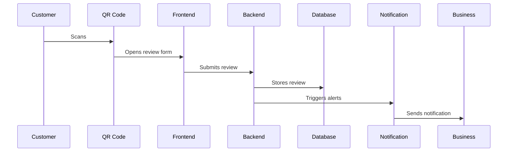
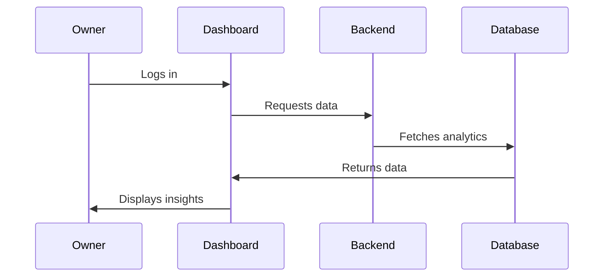

# Complete InStore Reviews Documentation

## Table of Contents
1. [Frontend Architecture](#frontend-architecture)
2. [Backend Architecture](#backend-architecture)
3. [Database Structure](#database-structure)
4. [File-by-File Explanation](#file-by-file-explanation)
5. [System Interactions](#system-interactions)
6. [Integration Points](#integration-points)

## Frontend Architecture

### Vue 3 Components Structure

#### 1. Core Components (`resources/js/components/`)

##### Review Components
- `ReviewForm.vue`
  ```vue
  // Main review submission form
  - Handles star rating input
  - Manages comment submission
  - Processes photo uploads
  - Validates user input
  ```

- `RatingStars.vue`
  ```vue
  // Star rating component
  - Interactive star display
  - Hover effects
  - Half-star support
  ```

##### Dashboard Components
- `Dashboard.vue`
  ```vue
  // Main dashboard layout
  - Navigation structure
  - Widget layout
  - Responsive design
  ```

- `AnalyticsWidget.vue`
  ```vue
  // Analytics display
  - Charts and graphs
  - Real-time updates
  - Data filtering
  ```

##### QR Code Components
- `QrGenerator.vue`
  ```vue
  // QR code generation interface
  - Template selection
  - Custom styling
  - Download options
  ```

- `QrPreview.vue`
  ```vue
  // QR code preview
  - Live preview
  - Size adjustment
  - Style customization
  ```

### State Management

#### Vuex Store Structure (`resources/js/store/`)
```javascript
store/
├── index.js          // Store configuration
├── modules/
│   ├── reviews/      // Review management
│   ├── qrcodes/      // QR code operations
│   ├── analytics/    // Analytics data
│   └── users/        // User management
```

## Backend Architecture

### Laravel Components

#### 1. Controllers (`app/Http/Controllers/`)

##### QR Management
- `QrMediaController.php`
  ```php
  // Handles QR code operations
  - Generation
  - Template management
  - Tracking
  ```

##### Review Processing
- `ReviewController.php`
  ```php
  // Manages review submissions
  - Validation
  - Storage
  - Response handling
  ```

##### Notification System
- `NotificationsController.php`
  ```php
  // Handles all notifications
  - SMS alerts
  - Email notifications
  - Push notifications
  ```

#### 2. Models (`app/Models/`)

##### Core Models
- `Business.php`
  ```php
  // Business entity model
  - Location management
  - User associations
  - Settings configuration
  ```

- `QrMedia.php`
  ```php
  // QR code data model
  - Media storage
  - Scan tracking
  - Template management
  ```

##### User Management
- `User.php`
  ```php
  // User model
  - Authentication
  - Permissions
  - Profile management
  ```

#### 3. Services (`app/Services/`)

##### Business Logic
- `ReviewService.php`
  ```php
  // Review processing service
  - Submission handling
  - Notification triggers
  - Analytics updates
  ```

- `QrGenerationService.php`
  ```php
  // QR code generation
  - Code creation
  - Template processing
  - Error handling
  ```

## Database Structure

### Core Tables

#### 1. Business Management
```sql
CREATE TABLE businesses (
    id BIGINT PRIMARY KEY,
    name VARCHAR(255),
    settings JSON,
    created_at TIMESTAMP,
    updated_at TIMESTAMP
);

CREATE TABLE business_locations (
    id BIGINT PRIMARY KEY,
    business_id BIGINT,
    name VARCHAR(255),
    address TEXT,
    settings JSON,
    FOREIGN KEY (business_id) REFERENCES businesses(id)
);
```

#### 2. QR System
```sql
CREATE TABLE qr_media (
    id BIGINT PRIMARY KEY,
    business_id BIGINT,
    location_id BIGINT,
    template VARCHAR(255),
    settings JSON,
    FOREIGN KEY (business_id) REFERENCES businesses(id),
    FOREIGN KEY (location_id) REFERENCES business_locations(id)
);

CREATE TABLE qr_scans (
    id BIGINT PRIMARY KEY,
    qr_media_id BIGINT,
    scanned_at TIMESTAMP,
    metadata JSON,
    FOREIGN KEY (qr_media_id) REFERENCES qr_media(id)
);
```

## System Interactions

### 1. Review Submission Flow


### 2. Business Dashboard Flow


## Integration Points

### 1. Twilio SMS Integration
```php
// SMS notification configuration
TWILIO_ACCOUNT_SID=your_sid
TWILIO_AUTH_TOKEN=your_token
TWILIO_FROM_NUMBER=your_number
```

### 2. Mailgun Email Integration
```php
// Email service configuration
MAILGUN_DOMAIN=your_domain
MAILGUN_SECRET=your_secret
MAILGUN_ENDPOINT=api.mailgun.net
```

### 3. Social Media Integration
```javascript
// Social media configuration
const socialConfig = {
    facebook: {
        apiKey: process.env.FB_API_KEY,
        pageId: process.env.FB_PAGE_ID
    },
    twitter: {
        apiKey: process.env.TWITTER_API_KEY,
        accessToken: process.env.TWITTER_ACCESS_TOKEN
    }
};
```

## File-by-File Purpose

### Frontend Files

#### 1. Component Files
- `ReviewForm.vue`: Customer review interface
- `Dashboard.vue`: Admin dashboard
- `QrGenerator.vue`: QR code creation
- `Analytics.vue`: Statistics display
- `UserManagement.vue`: User control

#### 2. Utility Files
- `validation.js`: Input validation
- `api.js`: API communication
- `helpers.js`: Common functions
- `constants.js`: System constants

### Backend Files

#### 1. Controller Files
- `QrMediaController.php`: QR management
- `ReviewController.php`: Review handling
- `UserController.php`: User management
- `AnalyticsController.php`: Statistics

#### 2. Model Files
- `Business.php`: Business logic
- `QrMedia.php`: QR code data
- `Review.php`: Review data
- `User.php`: User data

## System Configuration

### 1. Environment Setup
```env
APP_NAME=InStoreReviews
APP_ENV=production
APP_KEY=base64:your_key
APP_DEBUG=false
APP_URL=https://your-domain.com
```

### 2. Database Configuration
```env
DB_CONNECTION=mysql
DB_HOST=127.0.0.1
DB_PORT=3306
DB_DATABASE=instorereviews
DB_USERNAME=your_username
DB_PASSWORD=your_password
```

## Security Implementation

### 1. Authentication
```php
// User authentication setup
use Laravel\Sanctum\HasApiTokens;

class User extends Authenticatable
{
    use HasApiTokens;
    // User authentication methods
}
```

### 2. Authorization
```php
// Role-based access control
class RoleMiddleware
{
    public function handle($request, $next, $role)
    {
        if (!$request->user()->hasRole($role)) {
            return response()->json(['error' => 'Unauthorized'], 403);
        }
        return $next($request);
    }
}
```

## Testing and Quality Assurance

### 1. Unit Tests
```php
// Example test case
public function test_review_submission()
{
    $response = $this->post('/api/reviews', [
        'rating' => 5,
        'comment' => 'Great service!'
    ]);
    
    $response->assertStatus(200);
}
```

### 2. Integration Tests
```php
// API integration test
public function test_qr_code_generation()
{
    $response = $this->post('/api/qr/generate', [
        'location_id' => 1,
        'template' => 'default'
    ]);
    
    $response->assertStatus(200);
    $response->assertJsonStructure(['url', 'id']);
}
```

## Deployment Process

### 1. Production Deployment
```bash
# Deployment steps
php artisan down
git pull origin main
composer install --no-dev
php artisan migrate --force
php artisan config:cache
php artisan route:cache
php artisan view:cache
php artisan up
```

### 2. Server Requirements
- PHP >= 8.0
- Node.js >= 14.0
- MySQL >= 5.7
- Composer
- npm

## Maintenance and Updates

### 1. Regular Maintenance
- Daily backup scheduling
- Log rotation
- Cache clearing
- Security updates

### 2. Performance Monitoring
- Server resource usage
- Response times
- Error rates
- User activity

## Troubleshooting Guide

### 1. Common Issues
- QR code scanning problems
- Review submission errors
- Notification delays
- Dashboard access issues

### 2. Resolution Steps
- Error log checking
- Configuration verification
- Cache clearing
- Service restart procedures

## Support Resources

### 1. Technical Support
- Documentation access
- Support ticket system
- Emergency contacts
- Update notifications

### 2. User Support
- Help center access
- FAQ database
- Video tutorials
- Contact information

This documentation is continuously updated to reflect system changes and improvements. 